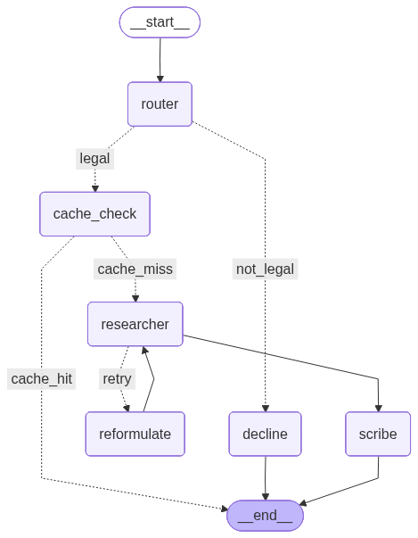

# ⚖️ Legal AI Assistant: Egyptian Civil Code


An advanced, agentic AI legal assistant specialized in the **Egyptian Civil Code**. Built using the **LangGraph framework**, this project employs a highly-optimized, multi-agent architecture to classify queries, perform deep semantic research, cache responses, and generate structured bilingual answers.

The system is designed with a strict **MVC (Model-View-Controller)** structure, making it highly modular and extensible. The agents adhere to an Object-Oriented paradigm following SOLID principles, ensuring scalability and ease of maintenance.

---

## ✨ Key Features & Capabilities

- **Agentic Workflow Engine**: Orchestrated by **LangGraph**, the system acts as a state machine that dynamically coordinates multiple specialized agents. The graph is lazily compiled and cached to ensure optimal execution speeds.
- **Ultra-Fast Heuristic Routing**: Employs an ultra-fast, regex-based keyword matcher and language detector to route queries in sub-millisecond time, bypassing expensive LLM classification calls.
- **Bilingual Interface**: Seamlessly detects whether the user is speaking Arabic or English and operates fluently in both, adapting both search mechanisms and synthesis language dynamically.
- **RAG & Vector Retrieval**: Employs **ChromaDB** with advanced sentence transformers to securely search across base legal collections and user-uploaded legal PDFs.
- **Optimized CPU Embeddings**: Uses HuggingFace's `mohamed2811/Muffakir_Embedding_V2` model, selected specifically for its superior performance on multilingual and Arabic legal text, running entirely locally on CPU.
- **Multi-Level Semantic Caching**: Identifies previously answered concepts via vector similarity (`semantic_cache` collection). If a highly similar query exists, it bypasses LLM inference and instantly returns the cached response.
- **Conversational Memory**: Utilizes `langgraph-checkpoint-sqlite` to persist state across conversational threads, allowing the assistant to remember context and answer follow-up questions accurately.
- **Interactive Streamlit UI**: Provides a clean, responsive, and dark-themed chat interface. Heavy models and embeddings are preloaded on startup using Streamlit's caching mechanisms.
- **Robust Ingestion Pipeline**: A dedicated `process.py` module to parse, clean, chunk (preserving RTL text properties), and index large Arabic legal PDFs. Uses MD5 hashing to skip unchanged files for rapid processing.

---

## ⚡ Performance & Latency Optimizations

This application has been meticulously engineered to minimize latency and provide sub-second retrieval times:

1. **Heuristic-First Pattern (Zero-LLM Retrieval)**: Replaced multiple LLM calls in the routing and parameter extraction phases with fast regex heuristics and local synonym dictionaries. LLM calls are reserved solely for the final answer synthesis (`ScribeAgent`).
2. **Native DB Filtering**: Article-specific lookups leverage ChromaDB's native `where` metadata filters for `O(1)` direct lookups instead of doing expensive post-filtering on vector similarity results.
3. **Fast Fallback Query Expansion**: Instead of using an LLM to reformulate poor queries during retries, the system utilizes a fast, local dictionary of Arabic/English legal synonyms to expand and refine queries instantly.
4. **Graph Edge Pruning**: The LangGraph execution bypasses the Semantic Cache if the Router's confidence score is low, preventing unnecessary database hits.
5. **Collection Caching**: ChromaDB collection instances (`legal_ar`, `semantic_cache`) are cached in memory as module-level singletons to prevent reloading the embedding model on every interaction.

---

## 🧠 System Architecture

### Multi-Agent Flow



The core application runs as a deterministic LangGraph state machine defined in `controllers/graph.py`:

1. **Router Node (`RouterAgent`)**: The entry point. Uses high-speed regex heuristics to classify the query's domain (legal vs. general greeting vs. out-of-domain) and detects the language.
2. **Cache Node (`CacheAgent`)**: Evaluates the Semantic Cache database. If the query's similarity to a past query exceeds `SIMILARITY_THRESHOLD` (e.g., `0.80`), it instantly returns the cached response and halts graph execution.
3. **Researcher Node (`ResearcherAgent`)**: If no cache hit, this agent takes over. 
   - Uses regex to extract article numbers or identify if the query is general.
   - Executes either a direct native `where` lookup (for specific articles) or an expanded semantic vector search.
   - **Retry Loop**: If the search returns 0 documents, a conditional edge triggers a **Reformulate Node** that instantly substitutes synonyms and retries the search. Maximum 2 attempts.
4. **Scribe Node (`ScribeAgent`)**: The synthesizer. It receives the retrieved legal documents, the conversation history, and the system prompts to draft a formal, accurate, and structured legal response via OpenRouter.

### Model-View-Controller (MVC) Structure

- **Controllers (`controllers/`)**: Business logic, Agent definitions (inheriting from `BaseAgent`), and LangGraph orchestrator.
- **Models (`models/`)**: Data access layer (ChromaDB, Semantic Cache, SQLite Checkpointer, Document Processing).
- **Views (`views/`)**: Presentation layer (Streamlit).

---

## 📁 Project Directory Structure

```text
Project/
├── app.py                     # Main application entry point -> routes to Streamlit
├── process.py                 # Document ingestion pipeline for parsing PDFs to ChromaDB
├── requirements.txt           # Python dependencies
├── .env                       # Environment variables (API keys & Config)
├── AGENTS.md                  # Quick reference documentation for agents
├── PDF/                       # Directory for raw source PDF legal documents
├── data/                      # Local databases and temporary data
│   ├── chroma_db/             # ChromaDB persistence directory
│   ├── checkpoints.db         # SQLite checkpointer for conversation memory
│   └── processed/             # Extracted/chunked text + MD5 hashes from PDFs
├── models/                    # Data Layer
│   ├── document_processor.py  # PDF text extraction and processing orchestration
│   ├── memory.py              # SQLite checkpointer initialization
│   ├── metadata_filtering.py  # Advanced filtering logic for ChromaDB
│   ├── multi_level_cache.py   # Hierarchical caching mechanism
│   ├── query_expansion.py     # Fast local synonym and keyword expansion
│   ├── ranking_system.py      # Re-ranking and result scoring logic
│   ├── semantic_cache.py      # Cache database integration
│   ├── semantic_chunking.py   # Specialized chunking logic for Arabic text
│   └── vector_store.py        # ChromaDB setup, retrieval logic, and singleton caching
├── controllers/               # Business Logic and LLM Agents
│   ├── base_agent.py          # Abstract BaseAgent class (OOP)
│   ├── cache_controller.py    # Cache management logic
│   ├── graph.py               # Orchestrates the agents into the final LangGraph
│   ├── graph_edges.py         # Conditional routing logic for graph state
│   ├── graph_nodes.py         # Node wrapper functions for LangGraph
│   ├── graph_state.py         # TypedDict definition of the graph state
│   ├── researcher.py          # Retrieval orchestration node
│   ├── router.py              # Heuristic Router implementation
│   └── scribe.py              # LLM Synthesis generation node
├── utils/                     # Configuration and helper utilities
│   └── config.py              # Centralized configuration and environment loading
└── views/                     # Presentation Layer
    └── streamlit_app.py       # Streamlit Chat GUI
```

---

## ⚙️ Technical Stack

- **LLM Provider**: [OpenRouter](https://openrouter.ai/) via `langchain_openai.ChatOpenAI`. Default Model: `openai/gpt-oss-20b:free`.
- **Embedding Model**: `mohamed2811/Muffakir_Embedding_V2` (HuggingFace, Multilingual Arabic).
- **Vector Database**: [ChromaDB](https://www.trychroma.com/).
- **Orchestration**: [LangGraph](https://python.langchain.com/docs/langgraph) & LangChain Core.
- **Frontend**: [Streamlit](https://streamlit.io/).
- **PDF Processing**: `PyMuPDF` (fitz) with RTL/NFKC normalization for high-quality Arabic extraction.

---

## 🚀 Setup & Installation

### 1. Prerequisites
Ensure you have **Python 3.10+** installed. It is highly recommended to use a virtual environment.

```bash
# Create a Virtual Environment
python -m venv agents-env

# Activate (Windows)
.\agents-env\Scripts\activate

# Activate (Mac/Linux)
source agents-env/bin/activate
```

### 2. Install Dependencies
Install all required libraries from the `requirements.txt`:
```bash
pip install -r requirements.txt
```

### 3. Environment Variables
Create a `.env` file in the root directory. **There are no defaults for these variables — the app will crash if they are missing.**

```env
# Required: OpenRouter API Key for the LLM
OPEN_ROUTER_API=your_api_key_here

# Required: Core parameters
SIMILARITY_THRESHOLD=0.80
TOP_K=5
EMBEDDING_MODEL=mohamed2811/Muffakir_Embedding_V2
LLM_MODEL=openai/gpt-oss-20b:free

# Optional: HuggingFace Token (if using gated models)
HF_TOKEN=your_hf_token_here
```

### 4. Document Ingestion (Data Pipeline)
To populate the vector database with legal knowledge, place your source PDFs in the `PDF/` directory and run the ingestion script. This will parse the PDFs, clean the text, perform semantic chunking, and persist the embeddings.

```bash
python process.py
```
*Note: You can safely run this command multiple times. It uses MD5 file hashing to skip unchanged PDFs automatically, saving processing time.*

### 5. Running the Assistant
You can launch the complete pipeline and the Streamlit UI using the following commands:

**Option A (Using App Launcher):**
This acts as the standard entry point and spins up Streamlit locally.
```bash
python app.py
```

**Option B (Direct Streamlit Run):**
If you want to run Streamlit directly targeting the presentation layer:
```bash
python -m streamlit run views/streamlit_app.py
```

---

## ⚠️ Disclaimer
**This is an AI-powered informative tool and does not constitute certified legal advice.** The answers generated are based on semantic retrieval from provided texts and probabilistic language models. Always consult a licensed attorney in the Arab Republic of Egypt for official legal rulings, contract drafting, and personal legal matters.
